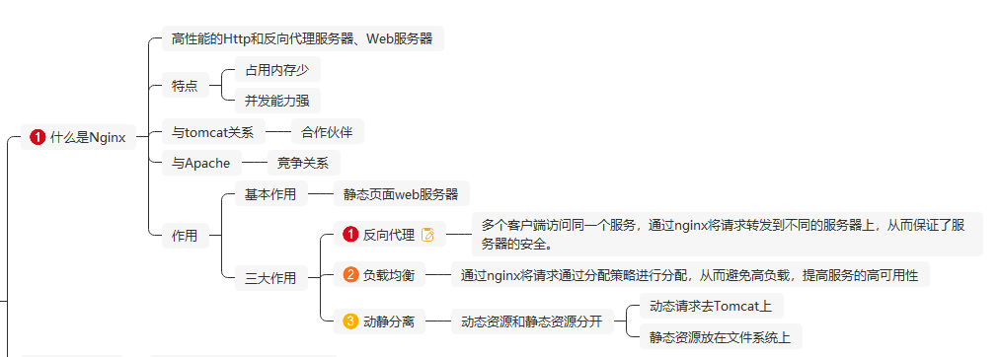

# 1、Nginx是什么？

*Nginx* ("engine x") 是一个高性能的HTTP和反向代理服务器，Web服务器，特点是占有内存少，并发能力强。

##  特点

- 占用内存少
- 并发能力强

**与tomcat应用web服务器：**

合作关系

**与Apache服务器：**

竞争关系

## 作用

### 1、反向代理

多个客户端访问同一个服务，通过nginx将请求转发到不同的服务器上，从而保证了服务器的安全。

### 2、负载均衡

通过nginx将请求通过分配策略进行分配，从而避免高负载，提高服务的高可用性

### 3、动静分离

动态资源和静态资源分开；其中动态请求去往Tomcat上，静态资源存放在文件系统中直接访问。

