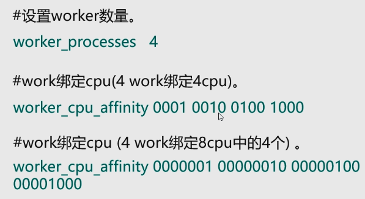

# 4、Nginx原理

启动nginx是启动了一个master进程，master又创建了多个worker进程。

##  4.1、 1master多worker机制

请求处理过程：

客户端进行请求，master监控到后，告知worker，worker进行争抢；如果是静态资源请求，worker直接在本地文件系统中获取资源；如果是动态请求，则会根据负载均衡的权重，分配到tomcat上。

## 4.2、多worker机制的优点

1、每个worker是一个独立的进程，不需要加锁，节省了锁开销，不会抢占资源。

2、一个worker挂掉，不会影响整个服务；一个进程结束，其它worker进程仍旧在运行。

3、 可以实现热加载。当-s reload时，先将空闲的worker进行重启，不会导致服务中断，待空闲下来，剩余的那个再进行重启，从而保证服务一直可用。

并不是worker数量越多越好：

根据机器的CPU进行设定，8核CPU定8个worker。每个worker进程由1个CPU运行。

##  4.3、IO多路复用机制

redis中也存在，实际上是linux的功能。

**经典的面试题**

一个请求过来会占用worker几个连接？

如果是静态资源是2个，如果是反向代理（动态请求）时是4个。

面试题：

nginx服务起了4个worker，每个worker的最大连接数是1024，问nginx的最大并发量是多少？

如果全都是静态资源时，4*1024/2 = 2048并发量  此时的并发量最大

